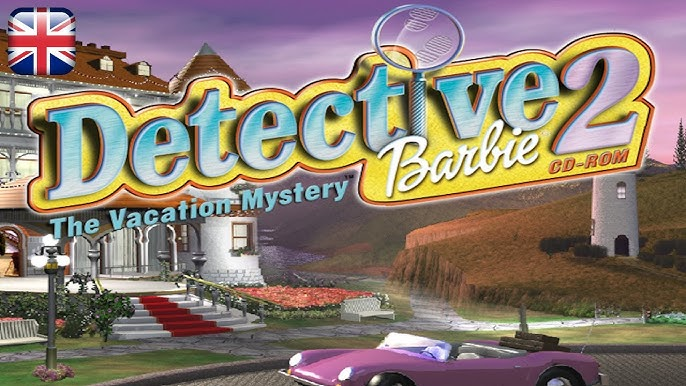
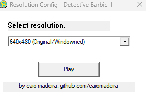
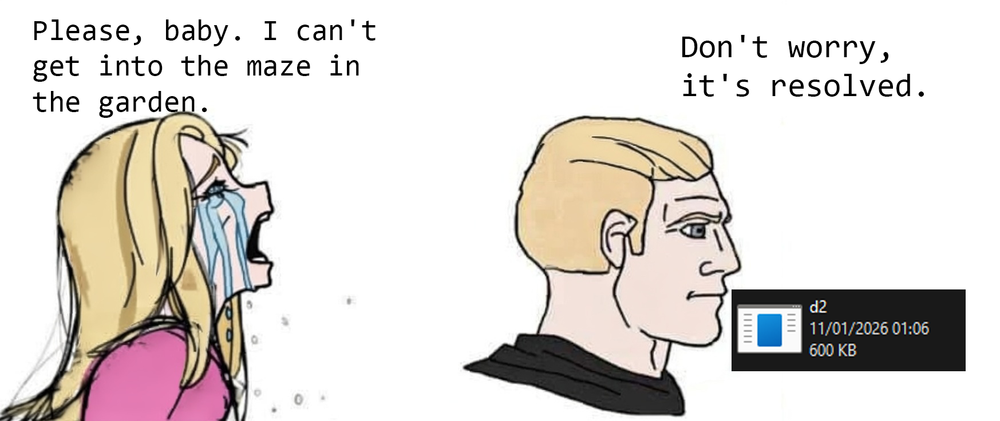

# RE Detective Barbie II

.

RE on Barbie Detective Barbie(R) II (1998).
Some patches made by me can found on release tab.

# Changelog

### V4.2 - Hooks/Wrappers
## ddraw.dll hook (window mode v1)

- Add two resultions supports with pre game menu.

### V4.0 - Patch: d2_v4.exe:
.
- Finally, fix the maze garden crash. You can see details on my [blog post](https://caiomadeira.github.io/posts/02-patch-barbie/).

## Patch: d2_patchv3.exe:
- Changes windowStyle (0x8008000) to 0xCF0000 (Border, Minimize/ Maximaze Buttons);
- Changes Window name;

## Tools:
- Ghidra;
- x32dbg;
- Microsoft Visual Studio;
