I want intercept windows system call and change to a modern window "window"(?). 

I need to find where's in the code set the resolution.

I know: 
- 640 = 0x280 in hex; 
- 480 = 0x1E0 in hex;

On little endian (inverted) the bytes must be:
- 280 = 80 02 00 00;
- 1E0 = E0 01 00 00;

- the resolution is hardcoded. Too much 0x280 (640) and checks.
- We are looking for functions. Functions receive arguments by PUSH instruction.

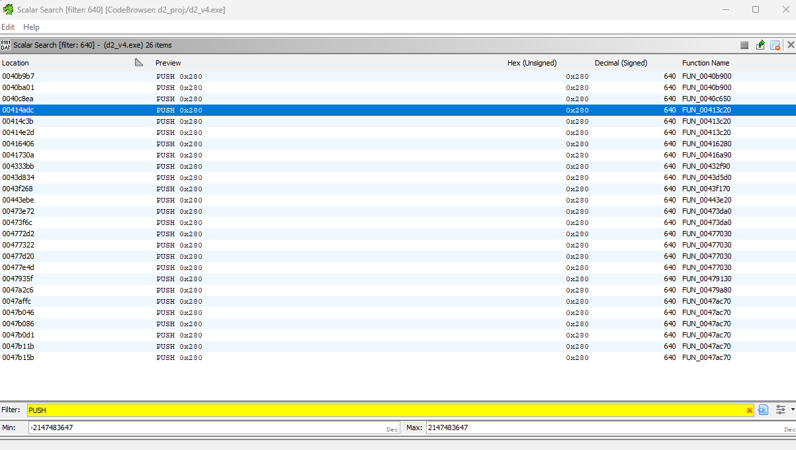

candidate 1
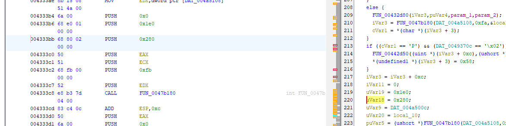

candidate 2
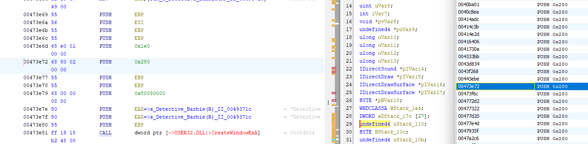

candidate 3
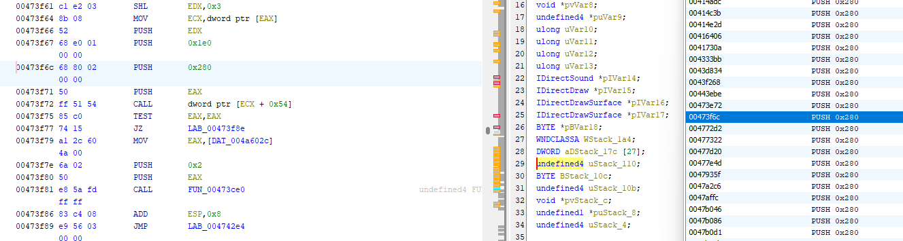

candidate 4
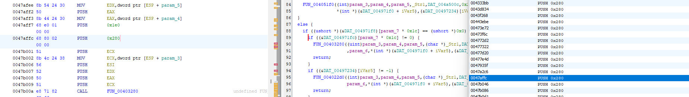

candidate 5
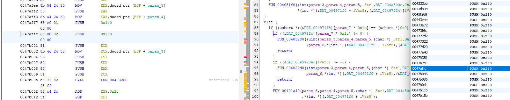

candidate 6
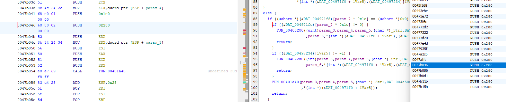

candidate 7
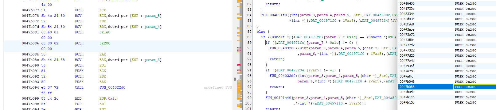

candidate 8 
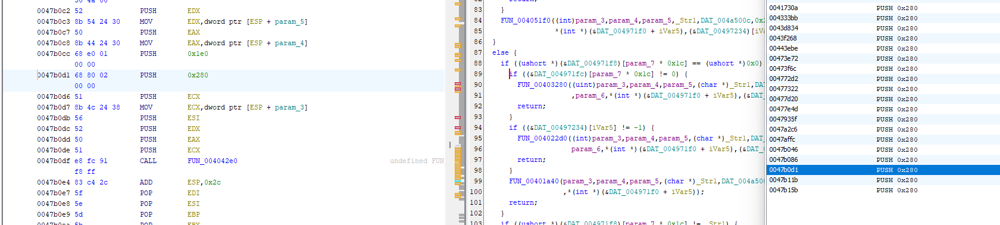

candidate 9

candidate 10
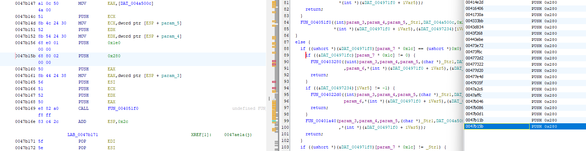
----
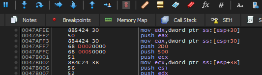
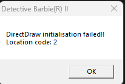
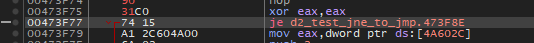
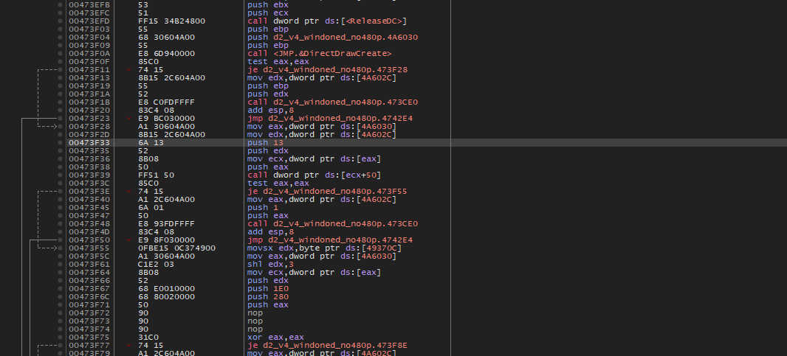
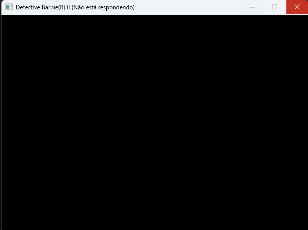
Mudar de push 0xCF0000 para push 0x10CF0000 funcionou a ponte de aparecer a janela preta.  

---
Functions looked
https://learn.microsoft.com/pt-br/windows/win32/api/wingdi/nf-wingdi-getdevicecaps

---