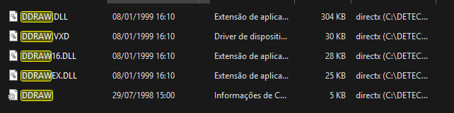
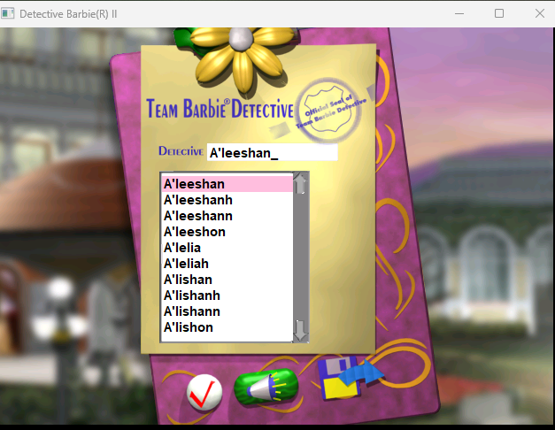
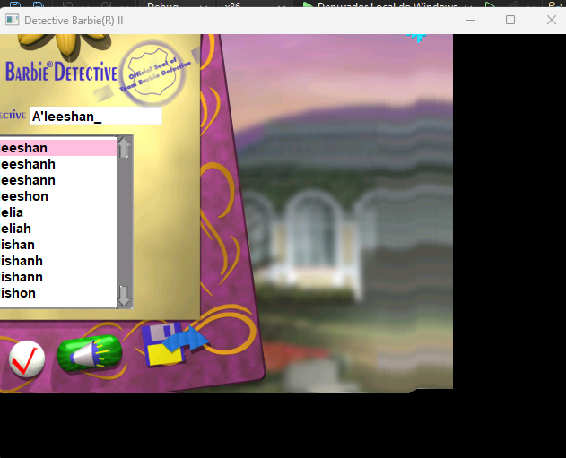

### Making a Wrapper

The main goal is not change the .exe file running on disk (like a patch). The idea is fake a system DLL.

If we look to d2.exe import table (on ghidra) or file system, we can see in the files a dll called ddraw.dll. If we create an fake ddraw.dll and put in the folder, windows can load our dll first.

### The non image redimension
We said to game to resize window, but not the rendered image. So if we drag over the game screen, this happen.

This is a **Blt** problem (Bit Block Transfer) and the missing Clipper.

### About Windows API

SetWindowsPos (https://learn.microsoft.com/pt-br/windows/win32/api/winuser/nf-winuser-setwindowpos)
Change the size, position and z-order of child window, pop-up or high level.

SWP_NOMOVE | SWP_NOZORDER | SWP_FRAMECHANGED: 

Related to window dimensions and positioning sinalizers. You can combine all parameters.
SWP_NOMOVE: Keep acutal position (ignores x and y parameters)
SWP_NOZORDER: Keep actual z-order.
SWP_FRAMECHANGED: Apply styles of differente frames.

----
AdjustWindowRect: In code, this functions guarantees 1280x720 for "Black area" of game, if the user selectes this option. The windows border sum with this value.